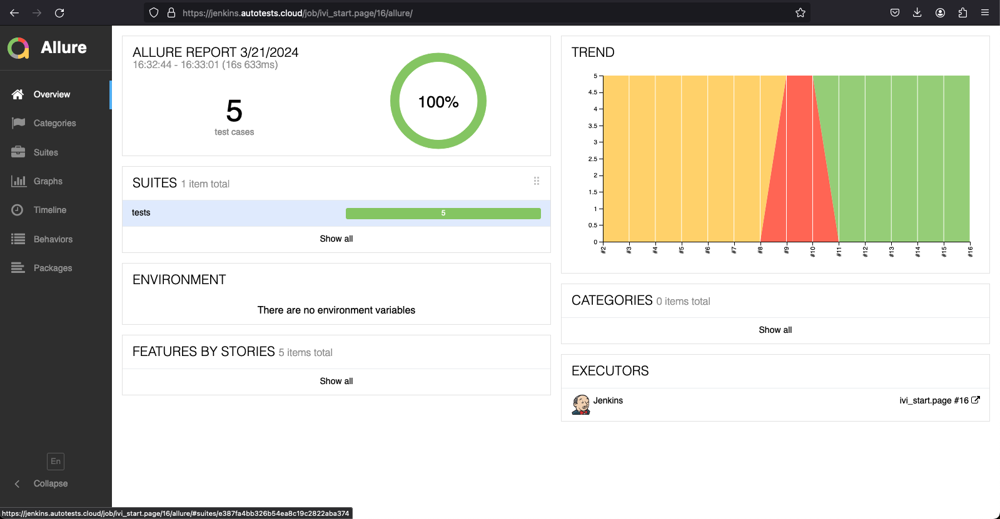
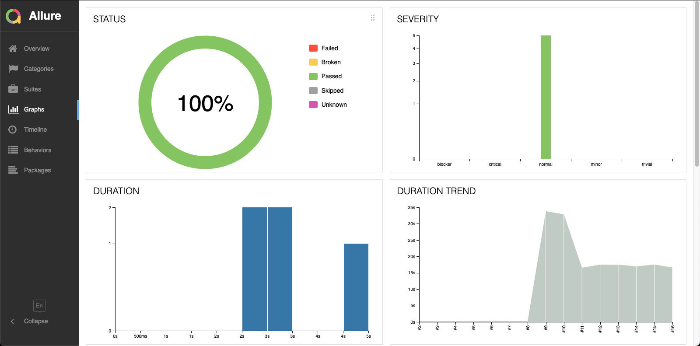
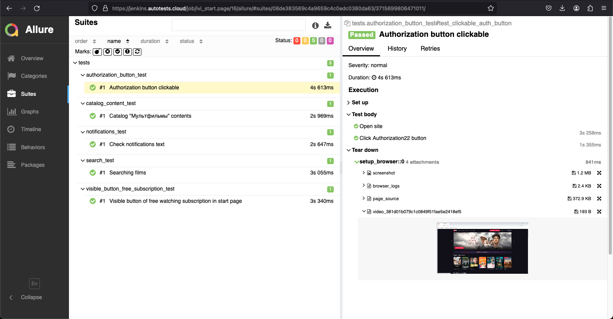
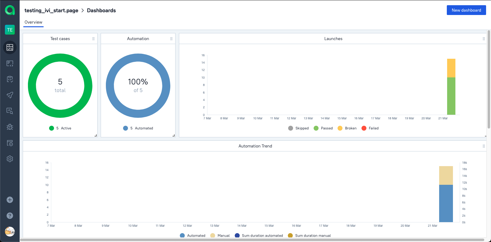
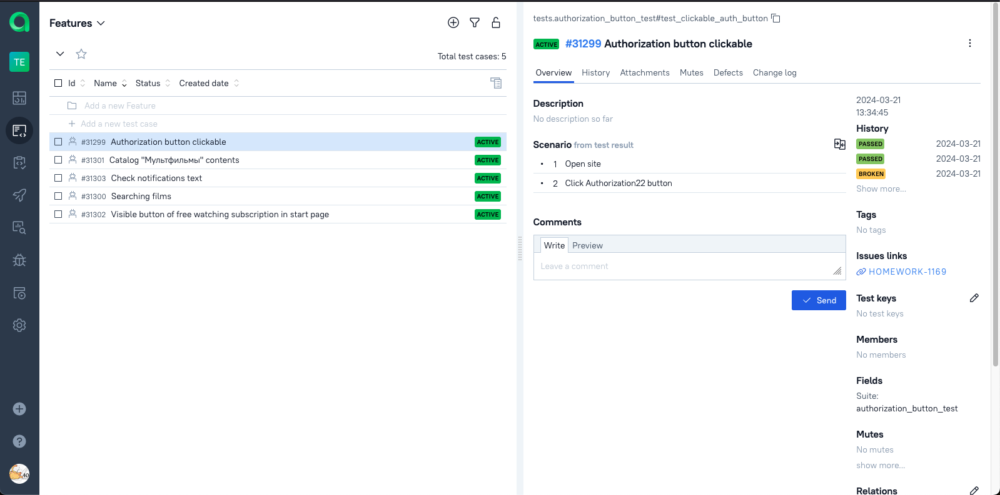
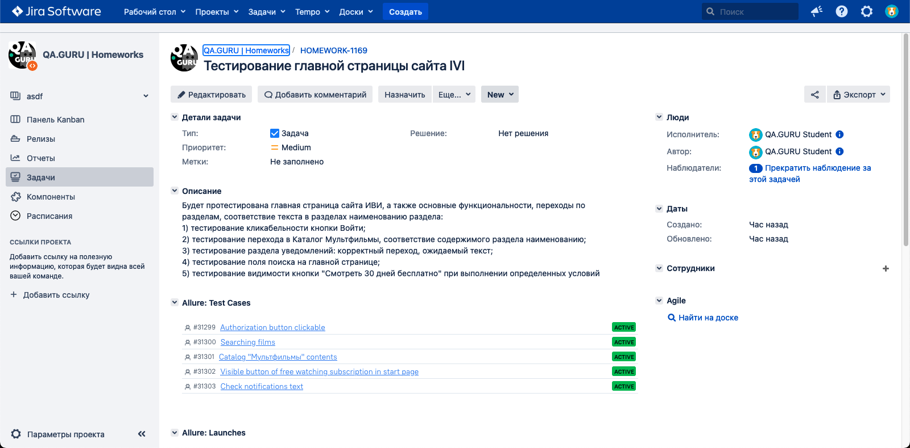
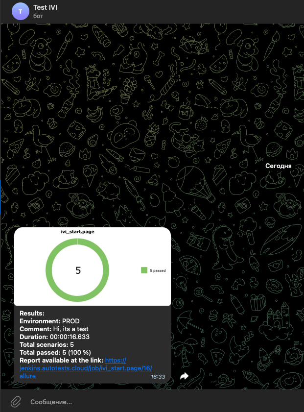

## Проект UI автотестов IVI

<!-- Технологии -->

### Используемые технологии

  <code></code>
  <code></code>
  <code></code>
  <code></code>
  <code></code>
  <code></code>
  <code></code>
  <code></code>
  <code></code>
  <code></code>
  <code></code>

<!-- Тест кейсы -->

### Будет протестирована главная страница сайта ИВИ, а также основные функциональности, переходы по разделам, соответствие текста в разделах наименованию раздела:
* тестирование кликабельности кнопки Войти 
* тестирование перехода в Каталог Мультфильмы, соответствие содержимого раздела наименованию 
* тестирование раздела уведомлений: корректный переход, ожидаемый текст 
* тестирование поля поиска на главной странице
* тестирование видимости кнопки "Смотреть 30 дней бесплатно" при выполнении определенных условий

<!-- Allure report -->

###  Allure report

##### Результаты тестов можно посмотреть в Allure отчете, откуда можно перейти и в Jenkins, где можно самостоятельно запустить сборку

##### Вкладка Graphs полезна для того, чтобы посмотреть графики о прохождении тестов.

##### Во вкладке Suites можно найти тест кейсы, в каждом из которых описаны шаги, а также приложени attachments: видео, скрины, фото, логи

<!-- Allure TestOps -->

###  Интеграция с Allure TestOps

### [Dashboard](https://allure.autotests.cloud/project/4138/dashboards)

##### Более наглядная отчетность находится в Allure TestOps.

#### Сьюты содержат в себе:
- Тест-кейсы
- Интеграция с Jira

<!-- Jira -->

###  Интеграция с Jira
##### С помощью Allure TestOps можно направлять отчет в Jira

<!-- Telegram -->

###  Интеграция с Telegram
##### В Telegram bot приходит сообщение с результатами тестирования.

